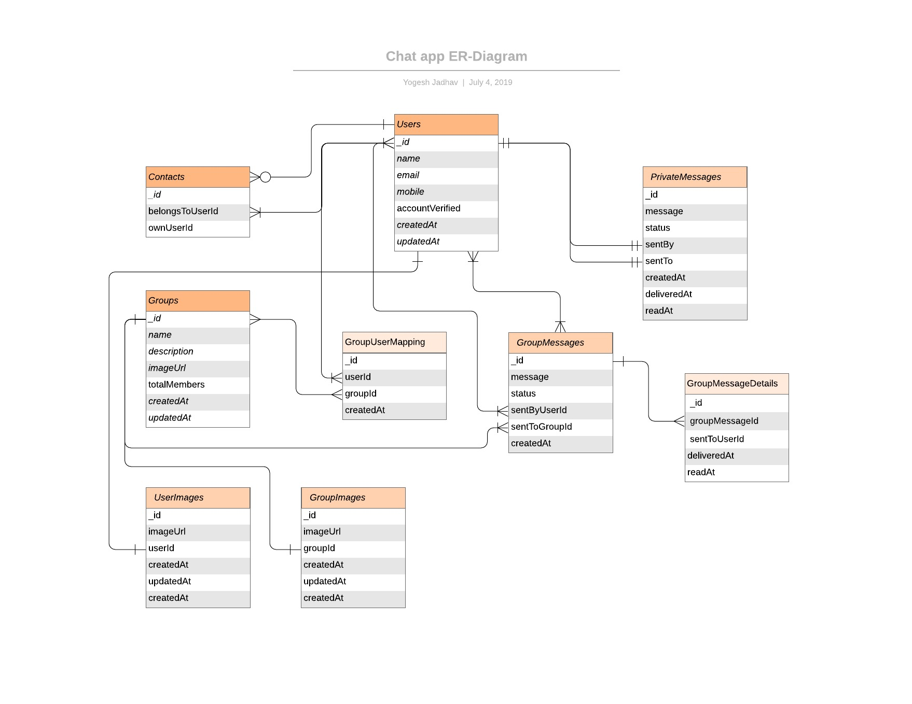

# Chat application using Websockets

This is a hobby project to demonstrate realtime we app development using websockets in nodejs.

## Steps to run backend service
1. Run command `docker-compose up -d`

## Features

- [ ] Google plus sign in
- [ ] Private Chat
- [ ] Group Chat

## ER-Diagram

[ER-Diagram](./documentation/ER-Diagrams/ER-Diagram.jpeg)